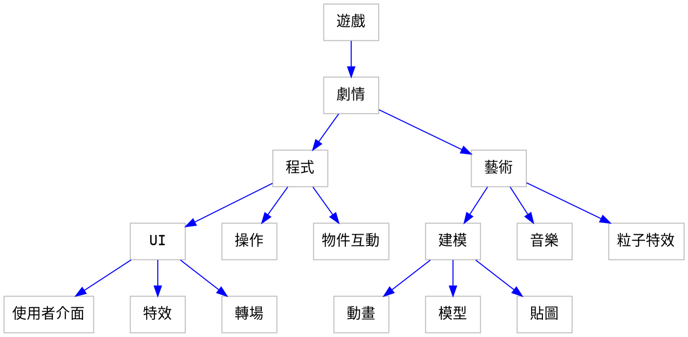

# Unity 遊戲計畫
## 故事大綱
###### tags: `mcl` `report` `unity`
### 人物介紹： 

LD是一個失業廢青，因為在都市裡找不到工作，每天無所事事，於是探險郊外就成了他唯一的興趣，在他腦海裡總是妄想著哪天能讓他找到一個寶藏，從此衣食無憂的過完下半輩子。 

### 故事經過： 

故事開頭–– 

在一個依舊碌碌無為的下午，LD來到了一座山裡面，傳聞說這邊有一個未知的區域，曾有一個農民清晨上山時經過了一片濃霧後不小心進入了其中，在其中，他發現四周的東西全部都是顛倒的，因為太詭異，所以那個農民也不敢冒進，當退出那片霧後，視界又回到了最初的樣子，而這之後有許多人紛紛前來查證這傳言的真實性，但在許多人無功而返後，這傳言也逐漸不被人所提起。 

LD一如往常地心想著：「或許我就是那個被寶藏選上的人」，他在山裡閒逛 著，一有山洞就進去查看，翻過了峭壁，潛泳到水裡，在經過了近十天的搜索，他已經把山區所有的區域都探查了一遍，他在湖泊邊梳洗，思索著自己是否有漏掉甚麼奇怪的地方，漸漸地，旁邊有白霧逐漸升起，當LD發覺時，留在他眼前的只剩下湖泊，而湖泊裡出現了一片奇怪的倒影，裡面的東西錯亂的擺放在各處，他好奇的把頭放進湖泊裡，忽然，他的世界開始翻轉，隨著一陣暈眩，LD昏迷了過去。 

當他醒來時，他倒在了草地上，四周是無邊無際的森林，在他不遠處有著一間小木屋，他不知道自己身在何處，於是四處走了走，發現除了樹還是樹，連一絲蟲鳴鳥叫都沒有，被逼無奈之下，他選擇回到了之前所看到的那間小木屋，想說在裡面能不能找到一些資訊，於是他進到小木屋裡面。 

他腳剛一踏進小木屋，視線突然模糊了，當他視野恢復清晰，他看到了一個比小木屋大了不少的房間，突然，LD聽到了一個聲音響起：「我是這高維空間的系統中樞，我的名子叫AN。」 

(在一個下午，LD來到了一個傳聞湖泊邊尋寶，漸漸地，旁邊有白霧逐漸升起，當LD發覺時，留在他眼前的只剩下湖泊，而湖泊裡出現了一片奇怪的倒影，裡面的東西錯亂的擺放在各處，他好奇的把頭放進湖泊裡，忽然，他的世界開始翻轉，隨著一陣暈眩，LD昏迷了過去。)

AN： 

你現在處於一個高維度的空間，若你想要離開這個空間，那你需要通過這空間裡的所有房間，你剛剛看到的森林以及小木屋就是其中的一個房間，而在最後一個房間裡，有著你所最渴望的東西，以及離開這空間的通道，我現在給你一個翻轉核心以及一個空間膠囊，翻轉核心可以幫你翻轉所在空間，而空間膠囊可以讓你裝一些物資，希望你能早日脫離。 

喔！對了！再賦予一個能力吧，它叫鷹眼，能夠俯瞰你所在的房間，隨著你翻轉的角度不同，你看到的畫面也會不同喔，那，祝你好運！ 

## 場景:
### 開場
門格海綿

### 木屋

&nbsp;&nbsp;&nbsp;&nbsp;&nbsp;&nbsp;&nbsp;&nbsp;你來到了一塊空地，這裡除了樹和一間小木屋什麼也沒有了，你試著想離開這裡，但是卻發現你居然會一直回到這小木屋旁邊，無奈之下你只好進到小木屋裡面......
&nbsp;&nbsp;&nbsp;&nbsp;&nbsp;&nbsp;&nbsp;&nbsp;&nbsp;&nbsp;&nbsp;&nbsp;&nbsp;&nbsp;&nbsp;&nbsp;&nbsp;&nbsp;&nbsp;&nbsp;&nbsp;&nbsp;&nbsp;&nbsp;&nbsp;&nbsp;&nbsp;&nbsp;&nbsp;&nbsp;&nbsp;&nbsp;&nbsp;&nbsp;&nbsp;&nbsp;&nbsp;&nbsp;&nbsp;&nbsp;&nbsp;&nbsp;&nbsp;&nbsp;&nbsp;&nbsp;&nbsp;&nbsp;&nbsp;&nbsp;&nbsp;&nbsp;&nbsp;&nbsp;&nbsp;&nbsp;&nbsp;&nbsp;&nbsp;&nbsp;&nbsp;&nbsp;&nbsp;&nbsp;&nbsp;&nbsp;&nbsp;&nbsp;&nbsp;&nbsp;&nbsp;&nbsp;&nbsp;&nbsp;&nbsp;&nbsp;&nbsp;&nbsp;&nbsp;&nbsp;&nbsp;&nbsp;&nbsp;&nbsp;&nbsp;&nbsp;&nbsp;&nbsp;&nbsp;&nbsp;&nbsp;&nbsp;&nbsp;&nbsp;&nbsp;想要逃離這裡嗎?那是不可能的，ㄎㄎㄎㄎ
#### 生物
兔子
樹

### 移動視界:

&nbsp;&nbsp;&nbsp;&nbsp;&nbsp;&nbsp;&nbsp;你好! 我是AN，我是這個區域的管理者，很高興看到你來到這邊，我是4維空間的生物，因為你們所存在的維度太低，所以我只好以投影的方式呈現，剛來到這個世界你一定很不熟悉吧，我來帶你參觀這邊的環境，跟好我，不然可是會迷路的喔 
 :smile: 

### 開發中

## 報告
demo:多重視界、奇怪的射擊遊戲

### 製作過程

:::spoiler 遊戲分類
ACT(動作)
ARPG(動作角色扮演)
AVG(冒險遊戲)
AAVG(動作冒險)
RPG(角色扮演)
RTS(即時戰略)
MMORPG(大型多人線上角色扮演遊戲)
SRPG(模擬角色扮演)
STG(射擊)
FPS(第一人稱射擊遊戲)
TPS(第三人稱射擊遊戲）
SPG(運動)
TBG(牌桌遊戲)
PZG(益智解謎)
RCG(賽車)
FTG(格鬥)
SLG(模擬)
VR(虛擬實境)
MOBA(多人線上戰術擂台)
ETC(其他)
QTE(快速反應事件)
:::

### 開發環境
#### 遊戲
1. GameMaker Studio 2 (GML)
 

2. Unity 


3. Unreal Engine(UE4)


#### 3D&2D繪圖
1.3DMax

2.voxedit


3.photoshop

#### 音樂
1.Ableton Live 10 Lite

2.acid PRO 10

3.musescore

### UNITY 介紹
實作...

#### unity 生命週期

